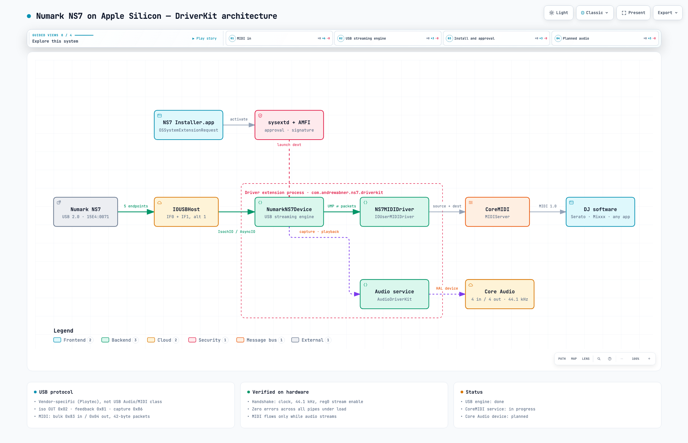

# Numark NS7 — Apple Silicon driver (DriverKit)

A modern macOS driver for the **Numark NS7** DJ controller, written as a user-space
**DriverKit system extension**. Numark's original driver (a 2016 Ploytec kernel extension,
v3.3.11) is x86-only and does not load on Apple Silicon; this project replaces it with a
driver built from the NS7's real USB protocol, verified on hardware.

| Component | Status |
|---|---|
| USB streaming engine (handshake, iso playback, rate feedback, capture, MIDI in/out pipes) | ✅ Working on hardware, zero errors under load |
| CoreMIDI device (controls → DJ software, LEDs ← software) | 🚧 In progress — [plan](docs/superpowers/plans/2026-09-26-coremidi-service.md) |
| Core Audio device (4 in / 4 out, 24-bit, 44.1 kHz) | 📋 Planned (AudioDriverKit) |

> **Status:** not yet usable in DJ software. The driver loads, claims the NS7 and streams,
> and MIDI from the controller reaches the driver — publishing it to CoreMIDI is the
> work in progress. Serato will most likely also need the audio device.

---

## System architecture

<a href="https://onewaydsp.github.io/NumarkNS7-DriverKit/architecture/ns7-system.html">
  <picture>
    <source media="(prefers-color-scheme: dark)" srcset="docs/architecture/ns7-system-dark.png">
    
  </picture>
</a>

**[▶ Open the interactive diagram](https://onewaydsp.github.io/NumarkNS7-DriverKit/architecture/ns7-system.html)** —
pan and zoom, trace relationships, step through guided views (MIDI in, USB streaming,
install & approval, planned audio), switch light/dark, and export PNG/SVG.
(GitHub can't run interactive HTML inside a README, so the image above links to the live
version on GitHub Pages; the source is [`ns7-system.html`](docs/architecture/ns7-system.html).)

The diagram is generated with [Archify](https://github.com/tt-a1i/archify) from
[`docs/architecture/ns7-system.architecture.json`](docs/architecture/ns7-system.architecture.json);
see [Regenerating the diagram](#regenerating-the-diagram).

---

## How the NS7 actually talks to a Mac

The NS7 is **not** a USB Audio Class or USB MIDI Class device (an early assumption in this
project that turned out to be wrong). Both interfaces are vendor-specific (class `0xFF`) and use
Ploytec's proprietary "bulk-in / isochronous-out" protocol. Everything below was read from a
physical NS7 and cross-checked against the original driver.

| Interface (alt 1) | Endpoint | Type | Role |
|---|---|---|---|
| IF0 | `0x02` | isochronous OUT, 156 B/microframe | Playback: 24-bit LE PCM, 4 ch, 5–6 frames per 125 µs |
| IF0 | `0x83` | bulk IN, 512 B | MIDI from the controller (42-byte packets, raw MIDI 1.0) |
| IF0 | `0x04` | bulk OUT, 512 B | MIDI to the controller (≤ 39 bytes + `0xFD` fill + `0xE0`) |
| IF1 | `0x81` | isochronous IN, 64 B / 1 ms | Rate feedback: byte 0 = frames this ms (44 / 45) |
| IF1 | `0x86` | bulk IN, 512 B | Capture: bit-sliced 64-byte frames, 8 per packet |

Startup handshake (replayed from the original kext): firmware info (`C0 56`), register 0 read
and internal-clock select (`C0/40 49`), `SET_CUR` 44 100 Hz on EP `0x86` and `0x02`, then the
stream-enable bits in register 0.

Two hardware facts shape the driver design:

- **The NS7 only sends MIDI while audio is streaming.** The driver therefore runs the audio pipes
  (silence when no app is playing) as soon as the device attaches.
- **If the host stops servicing the rate-feedback endpoint, the device stalls its bulk IN
  endpoints.** The driver keeps 8 feedback requests in flight, reschedules late isochronous
  requests, and clears/requeues stalled pipes.

The full bring-up story, with byte-level evidence, is in the [session log](docs/README.md).

---

## Repository layout

```
NumarkNS7Driver/                 DriverKit extension (dext)
  Sources/NumarkNS7Device.iig/.cpp   USB engine: claim, handshake, streaming, MIDI parsing
  Sources/NS7Protocol.h              Header-only protocol library (no DriverKit types)
  Info.plist, *.entitlements
NumarkNS7Installer/              SwiftUI app that activates/deactivates the dext
Tests/                           Host unit tests for NS7Protocol.h (ASan + UBSan)
Tools/ns7probe/                  IOUSBHost bring-up tool used to prove the protocol on hardware
docs/
  README.md                      Session log: how the protocol was verified and the driver built
  architecture/                  Archify diagram source, interactive HTML, README images
  superpowers/specs/, plans/     Design spec and implementation plan for the CoreMIDI service
  USB_ANALYSIS.md                Original analysis (partly superseded — see session log)
installer-scripts/               Command-line install/uninstall helpers
```

---

## Requirements

| | |
|---|---|
| **Mac** | Apple Silicon |
| **macOS** | 26 or later (the CoreMIDI service uses MIDIDriverKit, DriverKit 25) |
| **Xcode** | 26 or later |
| **Apple Developer Program** | Paid membership — needed to sign a DriverKit extension |
| **Hardware** | A Numark NS7 (USB `15E4:0071`) for anything beyond unit tests |

---

## Building and installing (development)

1. **Sign in** to Xcode with your Apple Developer account (Settings → Accounts) and accept any
   pending Program License Agreement at [developer.apple.com/account](https://developer.apple.com/account).
2. **Set your team** on both targets (`NumarkNS7Driver`, `NumarkNS7Installer`) and change the
   bundle identifiers (`com.andrewabner.ns7`, `com.andrewabner.ns7.driverkit`) to your own prefix;
   the installer references the dext identifier in `NumarkNS7InstallerApp.swift`.
3. **Build** the installer (it embeds the dext):
   ```bash
   xcodebuild -scheme NumarkNS7Installer -configuration Debug \
     -allowProvisioningUpdates -allowProvisioningDeviceRegistration build
   ```
4. **Install:** copy `NumarkNS7Installer.app` to `/Applications` (remove any old copy first —
   copying over it can leave a stale dext inside the bundle), open it, click **Install Driver**,
   and approve it in **System Settings → General → Login Items & Extensions → Driver Extensions**.
5. **Replug the NS7.** Matching happens at attach time; if the NS7 was connected before the
   driver was enabled, Apple's generic composite driver keeps it.
6. **Watch it run:**
   ```bash
   /usr/bin/log stream --predicate 'eventMessage CONTAINS "NumarkNS7"'
   ```
   Expect `handshake done`, `streaming: …`, and a `stats:` line every ~10 s with zero errors.

### Signing notes (learned the hard way)

- Development provisioning profiles grant `com.apple.developer.driverkit.transport.usb` with
  `idVendor = "*"`, and Xcode requires the entitlement to match exactly — so the entitlements
  file uses `"*"`. `Info.plist` still limits matching to the NS7. Distributing the driver to
  other people requires Apple to grant your team the NS7's vendor ID (`5604`).
- If the dext is rejected at launch with **AMFI "No matching profile found"**, the DriverKit
  profile predates your Mac's registration: delete it from
  `~/Library/Developer/Xcode/UserData/Provisioning Profiles/`, rebuild with
  `-allowProvisioningUpdates`, and bump `CURRENT_PROJECT_VERSION` so macOS replaces the extension.
- In zsh, `log` is a shell builtin — use `/usr/bin/log`.

---

## Testing

```bash
make -C Tests                 # host unit tests for NS7Protocol.h (ASan + UBSan, -Werror)
make -C Tools/ns7probe        # hardware probe (needs the NS7 and no driver attached)
./Tools/ns7probe/build/ns7probe init                  # dry run: print every control request
./Tools/ns7probe/build/ns7probe init 20 --send --stream   # handshake + stream + print MIDI
```

The probe sends nothing to the device without `--send`, and puts both interfaces back on
alternate setting 0 when it exits.

---

## Roadmap

1. **CoreMIDI service** — `NS7MIDIDriver` (MIDIDriverKit) publishing device *Numark USB Audio
   Device*, entity *MIDI*, one source and one destination, named like Numark's original driver;
   MIDI out through a lock-free FIFO to EP `0x04`. See the
   [design](docs/superpowers/specs/2026-09-26-coremidi-service-design.md) and
   [plan](docs/superpowers/plans/2026-09-26-coremidi-service.md).
2. **Core Audio device** — AudioDriverKit service exposing the capture and playback streams the
   engine already runs, clocked from the capture stream and the rate feedback.
3. **DJ software validation** — Serato DJ, Mixxx, and generic CoreMIDI apps.
4. **Distribution** — Apple's vendor-specific USB entitlement, notarized installer.

---

## Live collaboration sessions

Build this driver with us, live. Open pair-programming sessions run on the schedule below
(all times US Eastern): we drive [Claude Code](https://claude.com/claude-code) on this repo,
talk through the protocol, and test on a real NS7 when one is attached. Everyone is welcome —
no NS7 or Apple Developer account needed to join.

| When (ET) | Join | Add to calendar |
|---|---|---|
| **Mondays, 7:00–8:00 pm** | [meet.google.com/avd-uvsw-qcc](https://meet.google.com/avd-uvsw-qcc) | [Google Calendar](https://calendar.google.com/calendar/render?action=TEMPLATE&text=NS7+DriverKit+%E2%80%94+Claude+Code+collaboration+%28Mondays%29&dates=20260928T190000%2F20260928T200000&ctz=America%2FNew_York&recur=RRULE%3AFREQ%3DWEEKLY%3BBYDAY%3DMO&details=Open%2C+live+pair-programming+session+on+the+Numark+NS7+DriverKit+driver%2C+built+with+Claude+Code.%0ARepo%3A+https%3A%2F%2Fgithub.com%2Fonewaydsp%2FNumarkNS7-DriverKit%0AJoin%3A+https%3A%2F%2Fmeet.google.com%2Favd-uvsw-qcc&location=https%3A%2F%2Fmeet.google.com%2Favd-uvsw-qcc) |
| **Saturdays & Sundays, 4:00–5:00 pm** | [meet.google.com/dmw-qayp-fsx](https://meet.google.com/dmw-qayp-fsx) | [Google Calendar](https://calendar.google.com/calendar/render?action=TEMPLATE&text=NS7+DriverKit+%E2%80%94+Claude+Code+collaboration+%28weekends%29&dates=20260927T160000%2F20260927T170000&ctz=America%2FNew_York&recur=RRULE%3AFREQ%3DWEEKLY%3BBYDAY%3DSA%2CSU&details=Open%2C+live+pair-programming+session+on+the+Numark+NS7+DriverKit+driver%2C+built+with+Claude+Code.%0ARepo%3A+https%3A%2F%2Fgithub.com%2Fonewaydsp%2FNumarkNS7-DriverKit%0AJoin%3A+https%3A%2F%2Fmeet.google.com%2Fdmw-qayp-fsx&location=https%3A%2F%2Fmeet.google.com%2Fdmw-qayp-fsx) |

**How a session works:** the host shares a Claude Code session working on this repository;
participants suggest prompts and review changes in the call, and anyone can pick up an issue
and work in their own Claude Code session on a branch, opening a pull request against
`dext-streaming`. Hardware tests run only on the host's machine.

---

## Regenerating the diagram

```bash
git clone --depth 1 https://github.com/tt-a1i/archify.git /tmp/archify
A=/tmp/archify/archify
node $A/bin/archify.mjs validate architecture docs/architecture/ns7-system.architecture.json --quality showcase --json
node $A/bin/archify.mjs deliver  architecture docs/architecture/ns7-system.architecture.json docs/architecture/ns7-system.html --quality showcase --json
node $A/bin/archify.mjs visual-check docs/architecture/ns7-system.html --json   # browser screenshots
```

Copy the 2048×1320 light/dark screenshots over `ns7-system-light.png` / `ns7-system-dark.png`.

---

## Contributing

Issues and pull requests are welcome — please target the `dext-streaming` branch. Protocol
changes belong in `NS7Protocol.h` with a host unit test; anything that touches the device
should say how it was verified on hardware.

## Legal

This is an independent interoperability project, not affiliated with or endorsed by Numark or
inMusic. The protocol was determined by observing the device and analysing the original
driver for compatibility; no Numark code is included. No license has been chosen yet — until
one is added, all rights are reserved by the author.
